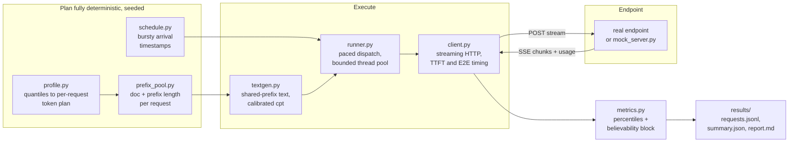

# llm-traffic-replay

Replay **your production traffic shape** against an LLM serving endpoint,
instead of testing with generic synthetic load.

Flat-rate load tests with uniform prompts produce latency numbers that do
not transfer to production. Real agent traffic has three properties that
drive serving behavior, and this harness reproduces all three:

1. **Heavy-tailed prompt sizes** — sampled from distributions fitted to your
   stated quantiles (e.g. P50 10K input tokens, P95 24K; outputs 40 to 90).
2. **High, variable prompt-cache hit ratio** (e.g. P50 60%, P95 87%) — you
   cannot ask an endpoint for a hit rate; the harness **constructs** it by
   making requests share long leading context the way production traffic
   actually repeats.
3. **Bursty arrivals** — spikes between 10 and 500 QPS, not a steady drip.

It works against any OpenAI-compatible streaming chat endpoint, which
includes Databricks provisioned throughput and pay-per-token serving as
well as other hosted providers, so the same instrument that measures your
candidate endpoint also measures the alternatives on an identical basis.

## Requirements

Python 3.10+, `numpy`. That is the whole list; the HTTP client is standard
library. Tests run with `pytest` if you have it, or with the bundled
zero-dependency runner if you don't.

## Quickstart (no endpoint needed, ~60 seconds)

```bash
# 1. Full test suite
python -m pytest                          # or: python3 scripts/run_tests_stdlib.py

# 2. Instrument self-test against the bundled mock (known latency model)
python -m traffic_replay validate
```

`validate` runs the entire pipeline — sampler, prefix pool, burst schedule,
streaming client, measurement — against a local mock server that KNOWS its
own true latency per request, then reports client-measured minus
server-true error. Current calibration on a laptop-class machine: TTFT
error p50 ≈ 2 ms, p95 < 5 ms. If this does not PASS on your machine, do not
trust any number the harness produces there.

## Run against a real endpoint

```bash
export DATABRICKS_TOKEN=...   # or any bearer token your endpoint accepts
# edit configs/run_smoke.json: base_url, path
python -m traffic_replay run --config configs/run_smoke.json
```

Outputs land in `results/<timestamp>/`:

- `requests.jsonl` — every request: TTFT/TTFB/E2E ms, endpoint-reported
  prompt/completion/cached tokens, intended sizes, document id, dispatch
  lag, errors.
- `summary.json` — percentile tables plus the believability block.
- `report.md` — the human-readable readout.

Then follow `docs/PRODUCTION_TESTING.md` for the staged plan: smoke test on
shared capacity (client correctness only), then the provisioned throughput
endpoint at stepped rate scales, then customer-dataset replay.

## Reading results: the honesty rules

Every latency table ships with the context that decides whether it can be
believed, and the report prints them together:

- **Achieved cache fraction** (endpoint-reported, with the exact usage
  field named). A good p50 at an unrealistic hit rate is a fake result.
- **Constructed vs achieved**: what the traffic intended vs what the
  endpoint served. Cold first-uses are included and visible per document.
- **Token targeting error**: text is generated through a calibrated
  characters-per-token ratio; endpoint-reported token counts are the source
  of truth and the residual error is printed.
- **Dispatch lag**: how late the client fired versus the schedule. If the
  client saturates, that is reported as client lag, not silently blended
  into endpoint latency.
- **Profile label**: runs built to stated (spoken) figures carry that
  label until the exact production dataset replaces the profile config.

## Architecture



Per-request sequence and the validation design are in
`docs/ARCHITECTURE.md`.

## Repository layout

```
traffic_replay/          the package (profile, prefix_pool, schedule,
                         textgen, sse, client, metrics, runner,
                         mock_server, cli)
configs/                 profiles and run configs (JSON)
tests/                   pytest suite (32 tests)
scripts/run_tests_stdlib.py   zero-dependency test runner
docs/ARCHITECTURE.md     diagrams and design decisions
docs/PRODUCTION_TESTING.md   step-by-step run plan
```

## Provenance and labels

The bundled `configs/profile_decagon_20260723.json` is built to
customer-stated figures from the 2026-07-23 call and says so in its label.
When the exact production dataset lands, it replaces that config file and
the label comes off. Nothing else in the harness changes.
