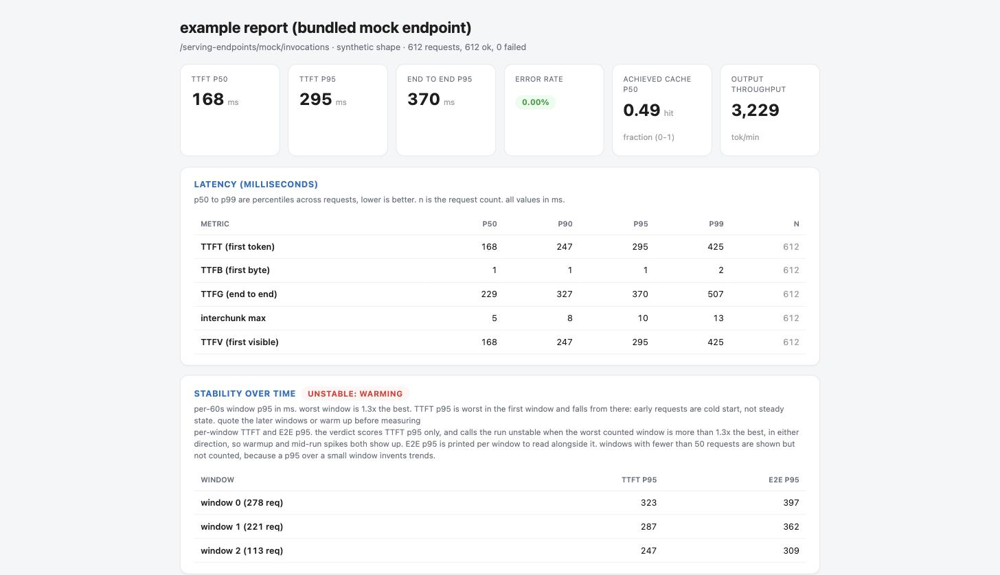
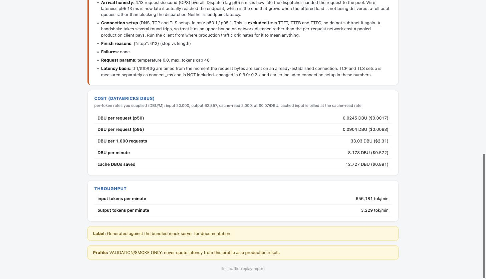

# llm-traffic-replay

[](https://github.com/debu-sinha/llm-traffic-replay/actions/workflows/tests.yml)

Replay **your production traffic shape** against an LLM serving endpoint,
instead of testing with generic synthetic load.

Flat-rate load tests with uniform prompts produce latency numbers that
don't transfer to production. Real agent traffic has three properties that
drive serving behavior, and this harness reproduces all three:

1. **Heavy-tailed prompt sizes**, sampled from distributions fitted to your
   stated quantiles (e.g. P50 10K input tokens, P95 24K, outputs 40 to 90).
2. **High, variable prompt-cache hit ratio** (e.g. P50 60%, P95 87%). You
   can't ask an endpoint for a hit rate, so the harness **constructs** it by
   making requests share long leading context the way production traffic
   actually repeats.
3. **Bursty arrivals**: spikes between 10 and 500 QPS, not a steady drip.
   You get synthetic bursts by default, and your own production arrival
   trace drops in via `timestamps_file` and replaces the synthetic schedule
   entirely.

It works against any OpenAI-compatible streaming chat endpoint. That
includes Databricks provisioned throughput and pay-per-token serving as
well as other hosted providers, so the same instrument that measures your
candidate endpoint also measures the alternatives on an identical basis.

## What it measures, and what it doesn't

The harness reproduces the *shape* of your traffic: prompt sizes, cache
structure, and arrival timing. It fills that shape with synthetic text. An
endpoint's latency and throughput depend on token counts, cache hits, and
arrival rate, not on what the words say, so the numbers transfer to
production even though the prompts themselves are gibberish.

It doesn't measure anything content-dependent. Response quality, guardrail
and safety triggers, and semantic routing all need real prompts. This is a
load-shape benchmark, not a quality eval.

## How the load model works

Three properties of your production traffic get rebuilt, each from settings
you control. The picture below is the whole mental model: you set the shape on
the left, the harness fills it with meaningless synthetic text, and the only
thing left to measure is the endpoint on the right.


| Traffic property | How it is built | Settings that control it |
| --- | --- | --- |
| Prompt sizes (heavy-tailed) | Fit a lognormal to your p50 and p95, then draw every request's input and output size from that fit. | Profile: `input_tokens` p50/p95, `output_tokens` p50/p95 |
| Cache reuse (shared prefixes) | A pool of shared-prefix documents, picked by Zipf popularity, gives requests a common leading block so the endpoint's prompt cache can engage. Your number is the target hit rate. | Profile: `cache_fraction` p50/p95. Config: `pool_zipf_s`, `pool_docs_per_bucket` |
| Arrival timing (bursty) | A two-state on/off model (MMPP) makes quiet stretches broken by spikes, or you replay your real arrival trace exactly. | Config: `qps_base`, `qps_burst`, `qps_min`, `qps_max`, `rate_scale`, or `timestamps_file` |

You can look at either shape before spending a single endpoint call.

`sample` draws from a profile and prints the sizes and cache fraction it
recovered, so you can confirm the profile matches your traffic:

```bash
python3 -m traffic_replay sample --profile configs/profile_agent_stated.json
```
```json
"recovered": {
  "input_tokens":  {"p50": 9967.0,  "p95": 23854.1},
  "output_tokens": {"p50": 40.0,    "p95": 90.0},
  "cache_fraction":{"p50": 0.60,    "p95": 0.87}
}
```

`schedule` builds an arrival curve and prints how bursty it is, so you know
what a config produces before you point it at anything:

```bash
python3 -m traffic_replay schedule --duration 300
```
```json
{
  "seconds": 300,
  "requests": 36928,
  "rate_p50": 38.2,
  "rate_p95": 438.9,
  "rate_max": 500.0,
  "spiky": true
}
```

`spiky` is true when peak QPS is at least 8x the trough. That is the bursty
regime this arrival model is built for. A flat load test won't surface the
queueing behavior that bursts do.

## Requirements

Python 3.10 or newer and `numpy`. That's the whole list, the HTTP client is
standard library. `pytest` is optional (a bundled zero-dependency runner runs
the same tests without it).

```bash
python3 -m pip install numpy      # add pytest for nicer test output, optional
```

Commands below use `python3`, which is what a stock macOS or Linux box has.
If your `python` already points at 3.10+ (a venv or conda env), `python`
works too.

## Try it with no endpoint (about 60 seconds)

Run every command from the repository root (the directory holding this file).
Don't `cd` into `traffic_replay/`, that is the package, and both
`python3 -m traffic_replay` and the relative `configs/` paths resolve from
the root.

```bash
git clone https://github.com/debu-sinha/llm-traffic-replay.git
cd llm-traffic-replay

# 1. Run the test suite (either runner; they run the same tests)
python3 -m pytest                 # no pytest? python3 scripts/run_tests_stdlib.py

# 2. Self-test the instrument against the bundled mock (known latency model)
python3 -m traffic_replay validate
```

`validate` runs the entire pipeline (sampler, prefix pool, burst schedule,
streaming client, measurement) against a local mock server that KNOWS its
own true latency per request, then reports client-measured minus
server-true error. Current calibration on a laptop-class machine: TTFT
error p50 ~2 ms, p95 < 5 ms. If it doesn't PASS on your machine, don't
trust any number the harness produces there.

## Run against a real endpoint

### Start here: one command

You need a host, an endpoint name, and a rough idea of your token sizes.
Nothing else, no JSON to author:

```bash
python3 -m traffic_replay benchmark \
  --host https://your-workspace.cloud.databricks.com \
  --endpoint your-endpoint-name \
  --auth-profile your-databrickscfg-profile \
  --input-tokens 10000,24000 \
  --output-tokens 40,90 \
  --cache-hit-rate 0.6,0.87 \
  --concurrency 30 --duration 300 \
  --ttft-p95 900 --ttfg-p95 1500 --success-rate 0.99
```

Each size takes `p50` or `p50,p95`. Pass one number and the p95 is set 2.4x
above it. Pass `--prompts your.jsonl` to replay your real prompts instead of
synthetic text, or `--profile` to use a profile you already built.

Before the load starts it sends two requests and tells you what the endpoint
actually does. That check exists because nearly every way this tool can hand
you a confidently wrong number is visible in two requests:

```
[preflight] sending 2 requests to see what this endpoint does
[preflight] 2/2 responded
[preflight] this is a REASONING model. it emits thinking tokens before the
            answer, and they count against max_tokens.
[preflight] and it produced NO visible answer within 512 tokens. at your
            output budget it will produce none either. raise --output-tokens,
            or turn reasoning down with --extra-body, before trusting any
            latency number from this endpoint.
[preflight] scoring TTFT on the first VISIBLE token, which is what a
            user-facing SLA describes.
```

It also warns when the endpoint reports no token usage (throughput and cost
will be blank) or no cached-token field (achieved cache cannot be reported).
For a reasoning model, turn thinking down and run again:

```bash
  --extra-body '{"reasoning_effort": "none"}'
```

The run writes `run-config.json` next to the results, so the same experiment
reruns with `python3 -m traffic_replay run --config <that file>`.

### The lower-level way: `quickstart`

`quickstart` writes a config without running it, which is what you want when
you plan to edit it or check it into a repo.

`quickstart` writes a runnable config from a host, an endpoint name and a
profile, so a first run doesn't mean hand-editing JSON:

```bash
python3 -m traffic_replay quickstart \
  --host https://your-workspace.cloud.databricks.com \
  --endpoint your-endpoint-name \
  --profile configs/profile_agent_stated.json \
  --concurrency 30 \
  --duration 300 \
  --ttft-p95 900 --ttfg-p95 1500 --success-rate 0.99 \
  --out configs/my_run.json

python3 -m traffic_replay run --config configs/my_run.json
```

`--concurrency` is the one worth knowing about. Load tests are specified in
concurrency, not in requests per second, so the harness measures service time
in a short sizing pass and derives the arrival rate and pool size from it.
Two things follow from that, and both are printed:

- The rate comes from service time measured **without** load. Service time
  rises under load, so the run tends to carry more than the number on the
  label. The report measures what was actually in flight and cautions in
  either direction, so read the measured value, not the flag you passed.
- The sizing requests are tagged `phase: "sizing"` and never reach the
  summary, but they are real billed traffic.

Auth: pass `--auth-profile <name>` to read a profile out of
`~/.databrickscfg` instead of exporting a token. A PAT profile is used
directly; an OAuth profile shells out to `databricks auth token`. If the
profile doesn't resolve, the run says so on stderr and falls back to the
environment variable rather than running unauthenticated.

### The long way: edit the config

Open `configs/run_smoke.json` and fill in the two `YOUR-...` placeholders,
your workspace host and the endpoint path:

```json
"endpoint": {
  "base_url": "https://your-workspace.cloud.databricks.com",
  "path": "/serving-endpoints/your-endpoint-name/invocations",
  "auth_token_env": "DATABRICKS_TOKEN"
}
```

Export the token that `auth_token_env` names, then run:

```bash
export DATABRICKS_TOKEN=<your PAT, or any bearer token the endpoint accepts>
python3 -m traffic_replay run --config configs/run_smoke.json
```

### What the report looks like

The example below is generated against the **bundled mock server**, whose
latency model is synthetic and known by construction. It shows the report
format. It is not a measurement of any serving provider, and you should not
read anything into its numbers.



Every number carries its unit. The stability card asks about errors first,
then compares TTFT p95 per 60-second window and says which shape it saw. Any
window too small to support a p95, or one that shed too many requests to have
a meaningful one, is printed but marked "not counted" rather than quietly
moving the verdict.

At the bottom sit the two things that decide whether a number can leave the
room:



The believability block names the exact usage field the cache fraction came
from, states that connection setup is excluded from TTFT, and prints the
latency basis so a saved report says which measurement convention produced it.
Note the two labels at the very bottom: your run label and the profile's own
label both print. A profile that says "never quote latency from this profile"
keeps saying it no matter what label you give the run.

Outputs land in `results/<timestamp>/`:

- `requests.jsonl`: every request: TTFT/TTFB/E2E ms, TCP/TLS `connect_ms`,
  endpoint-reported prompt/completion/cached tokens, intended sizes, document
  id, dispatch lag, errors, and `first_send_unix`. Wire lateness is derived
  in the summary from `first_send_unix` against `scheduled_s`.
- `summary.json`: percentile tables plus the believability block.
- `report.html`: the readout to open in a browser or share. Stat cards, a
  color-coded SLA scorecard, units on every metric, and the believability
  block as a callout. Self-contained, no internet needed.
- `report.md`: the same readout in plain text, for terminals and diffs.

Then follow `docs/PRODUCTION_TESTING.md` for the staged plan: smoke test on
shared capacity (client correctness only), then the provisioned throughput
endpoint at stepped rate scales, then customer-dataset replay.

## Bring your own data

There are two ways to feed the harness, pick the one that matches what you
have:

- **Token-count logs** (no prompt text): build a statistical profile and the
  harness sends synthetic text shaped to it. This section. Real prompt content
  never leaves your side.
- **The actual prompts you test with**: replay them verbatim. See
  [Bring your own prompts](#bring-your-own-prompts-real-text-no-profile) below.

Arrival timing (a trace) is optional and plugs into either path.

### 1. Traffic shape, from your logs

Export one row per request with three token counts. JSONL, one object per
line:

```json
{"input_tokens": 10231, "output_tokens": 42, "cached_tokens": 6100}
{"input_tokens": 8977,  "output_tokens": 55, "cached_tokens": 8004}
{"input_tokens": 24310, "output_tokens": 88, "cached_tokens": 15220}
```

or CSV with a header row:

```
input_tokens,output_tokens,cached_tokens
10231,42,6100
8977,55,8004
24310,88,15220
```

Only those three numbers per row are read. No prompt text is needed or
touched. Build a profile from the export and check it:

```bash
python3 scripts/profile_from_logs.py \
  --input your_logs.jsonl --name agent_real \
  --out configs/profile_agent_real.json

# confirm the recovered quantiles match your data
python3 -m traffic_replay sample --profile configs/profile_agent_real.json
```

That writes a profile like this (the P50/P95 the harness will reproduce):

```json
{
  "name": "agent_real",
  "input_tokens":   {"p50": 10126, "p95": 23193},
  "output_tokens":  {"p50": 45,    "p95": 86},
  "cache_fraction": {"p50": 0.618, "p95": 0.832},
  "provenance": "Computed from 400 request records.",
  "label": "Built from a real dataset. ..."
}
```

If your columns have other names, pass `--input-field` / `--output-field` /
`--cached-field`, or `--cache-fraction-field` if you already have a
per-request cache fraction instead of a cached-token count.

### 2. Arrival timing, from your trace (optional)

Export your request arrival times, one epoch-second value per line:

```
0.0
0.4
0.9
1.2
2.1
```

or JSONL with a `t` field per line:

```json
{"t": 0.0}
{"t": 0.4}
{"t": 0.9}
```

Times are shifted to start at zero and sorted for you, and the line count is
the request count. Leave this out and the harness uses its synthetic bursty
schedule instead.

### 3. Point a run config at both

Copy `configs/run_smoke.json` to `configs/run_byod.json`, set `profile_path`
to your new profile, add `timestamps_file` if you have a trace, and fill in
the endpoint. A minimal config:

```json
{
  "profile_path": "configs/profile_agent_real.json",
  "timestamps_file": "your_arrivals.txt",
  "endpoint": {
    "base_url": "https://your-workspace.cloud.databricks.com",
    "path": "/serving-endpoints/your-endpoint-name/invocations",
    "auth_token_env": "DATABRICKS_TOKEN"
  },
  "duration_s": 300,
  "out_dir": "results/agent",
  "title": "agent real-data run"
}
```

```bash
export DATABRICKS_TOKEN=<your token>
python3 -m traffic_replay run --config configs/run_byod.json
```

Every field you leave out falls back to the default in the settings reference
below. The report names the trace it ran from and carries the profile's
label, so a reader can see exactly what shaped the run.

## Bring your own prompts (real text, no profile)

If you don't have token-count logs but you do have the prompts you actually
test with, skip the profile entirely and replay those prompts verbatim. The
harness sends your real text and measures the endpoint on it. Sizes and any
cache reuse are whatever your prompts already are, so there's nothing to
construct or calibrate.

Put your prompts in a file. JSONL is the most flexible, one prompt per line,
each line any of these shapes:

```json
{"messages": [{"role": "system", "content": "You are a concise support agent."}, {"role": "user", "content": "A customer's order arrived two days late. Draft a short apology."}]}
{"prompt": "Explain provisioned throughput vs pay-per-token in two sentences."}
{"text": "Classify this ticket as billing, technical, or account: 'I was charged twice.'"}
```

`messages` is a full chat turn, sent as-is. `prompt` and `text` are shorthand
for a single user message. A plain `.txt` file works too (one prompt per
line), and a `.json` file may hold an array of any of the shapes above.

Point a run config at the file with `prompts_file` instead of `profile_path`.
Arrival timing still applies: leave it synthetic, or add `timestamps_file` for
your real trace. Your prompts cycle across the scheduled arrivals. Acceptance
targets are optional and score the same SLA scorecard:

```json
{
  "prompts_file": "your_prompts.jsonl",
  "endpoint": {
    "base_url": "https://your-workspace.cloud.databricks.com",
    "path": "/serving-endpoints/your-endpoint-name/invocations",
    "auth_token_env": "DATABRICKS_TOKEN"
  },
  "duration_s": 120,
  "max_output_tokens_cap": 300,
  "acceptance_targets": {"ttft_ms": {"p50": 1500, "p95": 3000}, "success_rate": 0.99},
  "out_dir": "results/agent_prompts",
  "title": "agent prompts-mode run"
}
```

```bash
export DATABRICKS_TOKEN=<your token>
python3 -m traffic_replay run --config configs/run_prompts.json
```

The report's believability block tells the reader this was real text, not a
constructed shape: it prints "real prompts replayed verbatim" and marks token
targeting not applicable, while still reporting achieved cache, throughput,
arrival honesty, and finish reasons. Set either `profile_path` or
`prompts_file`, not both.

## Steering model behavior (extra_body)

`endpoint.extra_body` is a dict merged into every request body, so you can
pass any parameter the endpoint accepts: sampling knobs, structured output,
and provider-specific thinking control. The harness-owned keys (`messages`,
`max_tokens`, `temperature`, `stream`, `stream_options`, `model`) always win,
so a run stays measurable no matter what you put here. Use the `temperature`
field for temperature, not `extra_body`.

Sampling and output shape, provider-independent:

```json
"endpoint": {
  "base_url": "https://your-workspace.cloud.databricks.com",
  "path": "/serving-endpoints/your-endpoint/invocations",
  "extra_body": {"top_p": 0.95, "stop": ["\n\n"], "seed": 42}
}
```

Turning thinking on or off depends on the model. Common shapes:

```json
"extra_body": {"reasoning_effort": "low"}
```
```json
"extra_body": {"thinking": {"type": "enabled", "budget_tokens": 2000}}
```
```json
"extra_body": {"chat_template_kwargs": {"enable_thinking": false}}
```

The first is OpenAI o-series style, the second is Anthropic extended thinking,
the third is how Qwen and GLM thinking models toggle on a vLLM-backed
Databricks endpoint. Check your endpoint's docs for the exact key, since a
param the endpoint doesn't recognize is usually ignored, and some reject it
with a 400 that the report shows as a failed request.

Every run echoes its parameters in the report so a reader knows what produced
the numbers:

```
request params: temperature 0.0, max_tokens cap 220, extra_body {"top_p": 0.95}
```

When the endpoint reports a thinking-token count
(`completion_tokens_details.reasoning_tokens`), the believability block adds a
line for it. Endpoints that stream a reasoning channel but don't report the
count leave the line out rather than guessing. To measure what thinking costs
on an endpoint, run it once with thinking on and once off, then `compare` the
two: the reasoning-token, TTFT, and end-to-end differences land side by side.

## Cost in Databricks DBUs

The report can turn the tokens it measured into cost, using rates you supply
from the [Databricks pricing page](https://www.databricks.com/product/pricing/foundation-model-serving).
The tool never fetches or hardcodes prices, so the report states the
arithmetic and the numbers you gave it. Databricks denominates in DBUs, and
the dollar conversion (`usd_per_dbu`) comes from your own plan or commit, so
it is optional.

Pay-per-token endpoints bill input, output, and cache-read tokens separately
(three DBU/M rates on the pricing page). The tool already measures those three
token counts, so the cost is exact:

```json
"pricing": {"mode": "per_token",
  "input_dbu_per_m": 20.0, "output_dbu_per_m": 62.857,
  "cache_read_dbu_per_m": 2.0, "usd_per_dbu": 0.070}
```

The report then shows DBU per request (p50/p95), DBU per 1,000 requests, DBU
per minute, and the DBUs the prompt cache saved. Leave `usd_per_dbu` out to
stay in DBUs.

Provisioned throughput bills capacity by the hour, not per token, so the
useful figure is effective cost per 1M tokens at the load you measured:

```json
"pricing": {"mode": "provisioned", "dbu_per_hour": 85.714, "usd_per_dbu": 0.070}
```

```
effective DBU per 1M tokens = dbu_per_hour / (tokens served per hour at the measured throughput)
```

That figure improves as you fill the endpoint, and it is what a
cost-per-throughput comparison against another provider actually needs.

## Where to run it

The harness measures client side, so the machine it runs on is part of the
experiment. Match the machine to the stage:

**Tests and `validate` (stage 0):** anywhere with Python 3.10+ and numpy.
A laptop is fine. The mock is local, so no network's involved.

**Smoke test (stage 1):** a Databricks notebook is the easiest path and is
what `notebooks/smoke_test_e2e_demo.ipynb` does: serverless or classic
compute, ambient workspace auth, no token handling. A laptop or VM with a
PAT works equally well at smoke rates (a few QPS).

**Measured PT runs (stage 2):** use a dedicated machine in the same cloud
region as the endpoint's workspace, and nothing else running on it. Two
good options: a single-node cloud VM (8 or more vCPUs, network-optimized),
or a single-node Databricks cluster in that workspace with the run started
from its driver (web terminal or a notebook `%sh` cell). Avoid laptops for
measured runs: Wi-Fi jitter, VPNs, sleep states and cross-region paths all
land in your TTFT tail and are indistinguishable from endpoint behavior
after the fact. The believability block reports wire lateness and the
achieved rate so a struggling client is visible, but the better plan is not
to generate that noise at all.
If wire lateness p95 grows past ~1 s at full rate_scale, or the report
prints the client-saturation caution, split the schedule across two machines
with `shard_index`/`shard_total` and pool the `requests.jsonl` files. As a
rough anchor, a single process on a laptop-class machine tracked a target
rate within 1 percent up to about 200 requests/second against a 50 ms
endpoint, and bent at around 270. Your ceiling depends on prompt size and
endpoint latency, so read the caution rather than trusting that number.

## Pooling and comparing runs

Sharded across machines? Pool their output dirs into one summary:

```bash
python3 -m traffic_replay merge results/pooled \
  results/m1/2026* results/m2/2026* results/m3/2026*
```

Pass `--profile` to `merge` to score the pooled run against acceptance
targets, and `--force` to merge runs whose endpoint paths differ. A merged run
gets no stability verdict, because pooled shards ran at different times and a
trend across them would describe the schedule, not the endpoint.

### Comparing Databricks against another provider

This is the main reason the tool exists, so it is worth doing properly. The
harness speaks OpenAI-compatible streaming chat, so the other provider is a
config change, not a code change. Only `endpoint` differs between the runs.

Databricks provisioned throughput or pay-per-token:

```json
"endpoint": {
  "base_url": "https://your-workspace.cloud.databricks.com",
  "path": "/serving-endpoints/your-endpoint/invocations",
  "auth_token_env": "DATABRICKS_TOKEN"
}
```

Any other OpenAI-compatible provider. These routes are shared across models,
so they need `model`, which a dedicated Databricks endpoint does not:

```json
"endpoint": {
  "base_url": "https://api.openai.com",
  "path": "/v1/chat/completions",
  "model": "gpt-4o-mini",
  "auth_token_env": "OPENAI_API_KEY"
}
```

The same shape works for Together, Fireworks, Anyscale, Baseten, vLLM and
anything else exposing `/v1/chat/completions` with bearer auth. Set the token
in the environment variable you named, never in the config.

There is no shipped config per provider, so make two.

**Start from your own profile, not the bundled one.** Build it from your logs
with `scripts/profile_from_logs.py` (see
[Bring your own data](#bring-your-own-data)). `configs/profile_validation_small.json`
exists to prove the instrument works and caps outputs at 12 tokens, so a
comparison built on it says nothing about either provider. It carries a label
saying exactly that, and the report prints a profile's label next to your own
label rather than instead of it, so that warning follows the numbers wherever
they go.

Copy `configs/run_smoke.json` twice, then in each copy:

- point `profile_path` at YOUR profile, the same one in both
- change the `endpoint` block, and give each its own `out_dir`
- raise `duration_s` to at least 240. A 60-second run is a single time window,
  so the stability check cannot run and `compare` will tell you it was never
  established
- replace the smoke `title` and `label`, which otherwise stamp the run
  "NOT PERFORMANCE EVIDENCE"

```bash
cp configs/run_smoke.json configs/run_dbx.json      # edit endpoint + out_dir
cp configs/run_smoke.json configs/run_other.json    # edit endpoint + out_dir

export DATABRICKS_TOKEN=...
python3 -m traffic_replay run --config configs/run_dbx.json
export OPENAI_API_KEY=...
python3 -m traffic_replay run --config configs/run_other.json

python3 -m traffic_replay compare results/compare \
  results/dbx/2026* results/other/2026*
```

**For the comparison to mean anything, hold these constant.** The tool checks
what it can and says so at the top of `comparison.md`, above the tables, but
some of it is on you:

| Must match | Why | Checked for you |
| --- | --- | --- |
| The profile | Different prompt sizes are different work | No, use one profile file for both runs |
| The client machine and region | Distance shows up in TTFT | No, run both from the same host |
| Harness version | 0.3.0 changed what TTFT includes | Yes, warns on mismatch |
| Achieved cache rate | A cached prompt is much cheaper to serve | Yes, warns on a gap over 0.10 |
| Cache reporting at all | A provider that reports no cached tokens is not comparable to one serving 57% from cache | Yes, warns loudly |
| Error rate | Percentiles only cover requests that succeeded, so a provider that dropped its slow requests looks faster | Yes, warns above 1% |
| Sample size | p99 needs requests behind it | Yes, warns under 100 |
| Steady state | A warming endpoint against a warm one is an artifact | Yes, warns when either run drifted |

The cache row is the one that most often invalidates a real comparison.
Databricks reports `prompt_tokens_details.cached_tokens`, and many providers
report nothing, in which case the achieved cache column reads
`NOT REPORTED`. That does not mean zero cache, it means you cannot
verify it, and a latency table built on top of that is not a like-for-like
result. `compare` says this above the tables, before any latency number, so it
is not something you have to notice in a cell.

## Reading results: the honesty rules

Every latency table ships with the context that decides whether it can be
believed, and the report prints them together:

- **Achieved cache fraction** (endpoint-reported, with the exact usage
  field named). A good p50 at an unrealistic hit rate is a fake result.
- **Constructed vs achieved**: what the traffic intended vs what the
  endpoint served. Cold first-uses are included and visible per document.
- **Token targeting error**: text is generated through a calibrated
  characters-per-token ratio. Endpoint-reported token counts are the source
  of truth, and the residual error is printed.
- **Client keeping up**: the generator is open loop, so it does not slow down
  when the endpoint does. Two numbers say whether it kept up. Dispatch lag is
  how late the dispatcher handed a request to the pool. Wire lateness is how
  late the client began sending, and it is the one to read:
  a saturated pool queues rather than blocking the dispatcher, so dispatch lag
  can sit in single-digit ms while requests wait minutes. When the run-average
  rate falls more than 20 percent below the schedule, or wire lateness p95
  passes one second, the report
  says the offered load did not reach the endpoint on schedule, and points at
  the stability card to separate a client limit from endpoint back-pressure. A
  client-side limit leaves endpoint latency flat.
- **Profile label**: runs built to stated (spoken) figures carry that
  label until the exact production dataset replaces the profile config.
- **Interchunk max**: the widest gap between streamed content chunks per
  request, so an SLA sensitive to mid-stream stalls has a number to read.
- **Output token targeting**: reported completion tokens vs intended, with
  the finish_reason mix (stop vs length), so a compressed output
  distribution is visible next to the calibrated input side.
- **SLA scorecard**: when the profile carries `acceptance_targets`, the
  report prints a pass/fail scorecard (TTFT, TTFG, hard-timeout and
  interchunk breaches, success rate). A missed target prints NO, not a dash.
- **Reasoning split**: for thinking models the report gives `ttft` (first
  token of either kind), `ttfr` (first reasoning) and `ttfv` (first visible)
  and flags when they diverge. `ttft_definition` picks which the scorecard
  scores.
- **Reasoning tokens**: when the endpoint reports a thinking-token count, the
  report prints total and per-request reasoning tokens with the usage field it
  came from. When it streams a reasoning channel but reports no count (some
  models do this), the report falls back to counting the reasoning deltas
  and labels the number a stream-counted estimate.
- **Cost**: when you supply DBU rates, the report shows cost per request, per
  1,000 requests, and per minute, plus the DBUs the cache saved, all traceable
  to the tokens measured and the rates you gave. See [Cost](#cost-in-databricks-dbus).
- **Request params**: the report echoes the temperature, max-tokens cap, and
  any `extra_body`, so a reader knows exactly what request parameters produced
  the numbers.
- **Prompt replay**: in prompts mode the supplied prompts cycle across the
  scheduled arrivals, so a small prompt set over a long run sends mostly
  verbatim repeats, and the endpoint prompt cache serves them. The report says
  how many distinct prompts were replayed and what share of requests were
  repeats, and cautions whenever there are more requests than prompts. Measured on a real endpoint: 10 prompts over 100
  requests went from 0% achieved cache on the first pass to 92% on the repeats.
  Read the achieved cache fraction as replay behavior unless the prompt set is
  at least as large as the request count.
- **Sample size**: the report counts the requests behind the percentiles and
  prints a caution when there are too few. Under 100 requests p99 is unstable,
  and under 30 the whole tail is indicative only. A tight p99 off 20 requests
  is not a result, and the report says so instead of letting the number stand.
- **Stability over time**: requests are bucketed into 60-second windows, and
  each window's success count, error count and TTFT/E2E p95 is printed. Two
  rules decide the verdict, in this order.

  First, errors. The run is `failing` when one window lost more than 5
  percent of its requests while the others held, or when every window is
  losing more than 10 percent. That is decided on error rate, not latency,
  because the survivors in a shedding window describe what the endpoint could
  still serve rather than what it was asked for. A window that lost more than
  a fifth of its requests is also marked "not counted" in the table, so you
  can see at a glance which rows the latency comparison refused.

  Second, latency. The run is unstable when the worst counted window's TTFT
  p95 is more than 1.3x the best, in either direction, reported as `degrading`
  (every window rises, the endpoint slowed under load), `warming` (every
  window falls from a slow start, so early requests are cold start and not
  steady state), `spike` (a middle window is much worse than both ends), or
  `variable` (the windows move around without a trend, so the run is noisy
  rather than drifting). A trend is only named when the windows actually move
  that way, so a noisy run is not sold as degradation, and comparing only the
  first window to the last is not enough either, because that reads a mid-run
  spike as stable and a 15x cold start as an improvement. E2E p95 is printed
  beside TTFT but not scored.

  Windows too small to support a p95 (a trailing partial window, say) are
  printed but marked "not counted" and left out of the latency comparison,
  because one slow request in a 5-request window would otherwise invent a
  trend. The error rule sizes its own floor on attempted requests, and a
  window that lost at least 5 requests and more than a fifth of them is
  judged whatever its size, so a window whose successes collapsed is not
  sized out. Below that, a tail window with 4 or fewer failures is printed
  with its error count but not scored, which keeps a single stray reset in a
  2-request tail from reading as a breaking point. A run needs two counted
  windows to get a latency verdict and three before any direction is named,
  so short runs print a note instead of a false verdict.
- **Connection setup (DNS, TCP, TLS)**: setup is timed separately and is
  **excluded** from TTFT, TTFB and TTFG, so don't subtract it again. It is
  several round trips, so read it as an upper bound on how far the client sat
  from the endpoint, not as the per-request network cost a pooled production
  client pays. Run from where production traffic originates or the number is
  not yours. This changed in 0.3.0, see [CHANGELOG.md](CHANGELOG.md).
- **Endpoint under test**: the report reads the serving endpoint's own config
  and prints what was actually being measured, so a report can't be quietly
  attributed to the wrong endpoint or a since-changed configuration. You always
  get the endpoint name, route-optimized and ready state. Task appears when the
  endpoint reports one. Served entity workload type and size appear only when
  the endpoint has a provisioned served entity. Pay-per-token foundation model
  endpoints report just a name, so those rows are absent rather than blank.

## Settings reference

Run configs are plain JSON deserialized into `RunConfig`
(`traffic_replay/runner.py`). Every field, with defaults:

| field | default | example | what it does, and when to change it |
|---|---|---|---|
| `profile_path` | null | `"configs/profile_agent_real.json"` | path to a profile JSON (shape mode). Set this or `prompts_file`, not both |
| `prompts_file` | null | `"your_prompts.jsonl"` | path to a real-prompts file, `.jsonl` / `.txt` / `.json` (prompts mode). Set this or `profile_path` |
| `endpoint.base_url` | required | `"https://your-ws.cloud.databricks.com"` | workspace host, no trailing slash |
| `endpoint.path` | required | `"/serving-endpoints/my-ep/invocations"` | the serving endpoint route. Model-serving uses `.../invocations` |
| `endpoint.auth_token_env` | `DATABRICKS_TOKEN` | `"DATABRICKS_TOKEN"` | env var the bearer token is read from. Never put the token in the config |
| `endpoint.model` | null | `"databricks-meta-llama-3-3-70b-instruct"` | set only for shared `/chat/completions` routes that need a model field; leave null for a dedicated `.../invocations` endpoint |
| `endpoint.auth_profile` | null | `"my-workspace"` | profile in `~/.databrickscfg` to read the token from, instead of an env var. PAT profiles are used directly, OAuth profiles call `databricks auth token`. Falls back to `auth_token_env` with a message on stderr if it can't resolve |
| `endpoint.connect_timeout_s` | 10 | `10` | TCP/TLS connect timeout. Raise on a slow/cold endpoint |
| `endpoint.read_timeout_s` | 120 | `120` | per-read socket timeout while streaming. Raise for long generations |
| `endpoint.temperature` | 0.0 | `0.0` | request temperature. Keep 0 for repeatable benchmarks |
| `endpoint.max_retries` | 1 | `1` | connection-error retries only. The retried count prints in the report |
| `endpoint.extra_body` | null | `{"top_p": 0.95}` | passthrough request params (top_p, stop, response_format, thinking control). Harness-owned keys always win. See [Steering model behavior](#steering-model-behavior-extra_body) |
| `duration_s` | 300 | `300` | how long the schedule runs, in seconds |
| `qps_base` / `qps_burst` | 25 / 350 | `2` / `8` | mean request rates of the two arrival states (quiet and burst). Set both low for a gentle probe, high for a stress run |
| `qps_min` / `qps_max` | 10 / 500 | `1` / `12` | hard floor and ceiling clamped on the rate curve |
| `rate_scale` | 1.0 | `0.5` | uniform thinning that keeps the shape. Step it 0.1 to 1.0 to find where the endpoint bends |
| `timestamps_file` | null | `"your_arrivals.txt"` | real arrival trace (one epoch/line, or JSONL `{"t": s}`) that replaces the synthetic schedule |
| `concurrency` | null | `30` | target in-flight requests. When set, a sizing pass measures service time and derives the arrival rate and pool size, overriding `qps_base`, `qps_burst`, `qps_min`, `qps_max` and `rate_scale`. The rate is derived from unloaded service time, so the run usually carries more than this number. The report measures what was actually held and cautions either way |
| `max_concurrency` | 256 | `64` | in-flight request bound. Set it above `qps * p95_latency_seconds` or the pool queues and the endpoint is never driven at the rate you asked for. Excess arrivals surface as wire lateness and a client-saturation caution, never as fake endpoint latency |
| `seed` | 7 | `7` | root RNG seed. Same config plus same seed is the same experiment |
| `cpt` | 4.0 | `4.0` | starting characters-per-token guess, recalibrated during warmup (profile mode only) |
| `calibrate_n` | 12 | `8` | warmup requests run before the schedule. Also primes the endpoint cache |
| `shard_index` / `shard_total` | 0 / 1 | `0` / `3` | deterministic 1-of-n schedule split, one per client machine, then `merge` the outputs |
| `pool_docs_per_bucket` | 40 | `40` | shared-prefix documents per size bucket (profile-mode cache structure) |
| `pool_zipf_s` | 1.1 | `1.1` | document popularity skew. Higher concentrates traffic on hot documents |
| `out_dir` | `results` | `"results/agent"` | output root. Each run writes a timestamped subdirectory under it |
| `title` / `label` | "" | `"PT stepped-load run"` | report title and the provenance label printed at the bottom of the report |
| `max_output_tokens_cap` | 512 | `300` | ceiling on `max_tokens` per request. Reasoning models spend this budget thinking first |
| `acceptance_targets` | null | `{"ttft_ms": {"p95": 900}}` | inline SLA targets (`ttft_ms`, `ttfg_ms`, `hard_timeouts`, `success_rate`, `interchunk_ms`). In prompts mode this is how the scorecard gets its targets |
| `ttft_definition` | `first_content` | `"first_visible"` | `first_content` (first token of either kind) or `first_visible` (skip reasoning deltas). The SLA scorecard scores whichever is set |
| `pricing` | null | `{"mode": "per_token", "input_dbu_per_m": 20, "output_dbu_per_m": 62.857}` | DBU cost rates you supply from the pricing page. The report turns measured tokens into cost. See [Cost](#cost-in-databricks-dbus) |
| `capture_endpoint_metadata` | true | `true` | read the serving endpoint's own config (name, task, route-optimized, ready state, and served entity workload type/size when it has a provisioned entity) and print it on the report. Best effort: if the token can't read the endpoint it logs one line to stderr and the run continues without the card. The served model's Unity Catalog path is deliberately not included, so the card is safe to share. Set false to skip the call entirely |

Profile JSON fields: `name`, then `input_tokens`, `output_tokens`, and
`cache_fraction` (each `{"p50": .., "p95": ..}`, cache in (0,1)).
`provenance` records where the numbers came from, and `label` is printed on
every report built from this profile. An optional `acceptance_targets`
object (ttft_ms, ttfg_ms, hard_timeouts, success_rate, interchunk_ms) drives
the SLA scorecard. Without it, no scorecard is printed.

Auth is never stored in any config. The token is read at run time from the
environment variable `auth_token_env` names, or from the `~/.databrickscfg`
profile `auth_profile` names, or in a notebook from the ambient workspace
context.

## Architecture


The per-request sequence and the validation design are in
`docs/ARCHITECTURE.md`.

## Repository layout

```
traffic_replay/          the package (profile, prefix_pool, schedule,
                         textgen, sse, client, metrics, runner,
                         prompts, endpoint_meta, mock_server,
                         aggregate, cli)
configs/                 profiles and run configs (JSON)
tests/                   pytest suite (unit + end-to-end)
scripts/run_tests_stdlib.py   zero-dependency test runner
scripts/profile_from_logs.py  build a profile JSON from real request logs
scripts/pack_notebook.py      rebuild the notebook's embedded copy of the
                         package. RUN THIS after any change under
                         traffic_replay/ or tests/, or the notebook keeps
                         measuring the old code
notebooks/               self-contained Databricks workspace smoke notebook
                         (embeds this repo, ambient auth, smoke labels)
CHANGELOG.md             what changed per release, including what 0.3.0
                         changed about the latency numbers
docs/ARCHITECTURE.md     diagrams and design decisions
docs/PRODUCTION_TESTING.md   step-by-step run plan
```

## Provenance and labels

The bundled `configs/profile_agent_stated.json` is built to figures that
were stated verbally rather than measured, and its label says so. When a
profile derived from real logs replaces it, the label comes off. Nothing
else in the harness changes.

`configs/profile_agent_blended.json` is the other bundled shape. It blends two
workload classes into one distribution, which is why its P90 points do not sit
on a single curve through the P50 and P95 anchors. Its acceptance targets are
illustrative, so replace them with the ones you agreed before scoring a run
against them.
