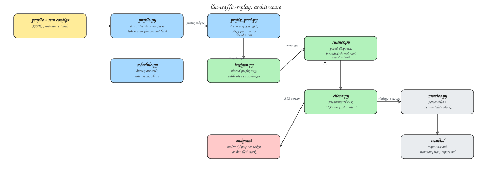
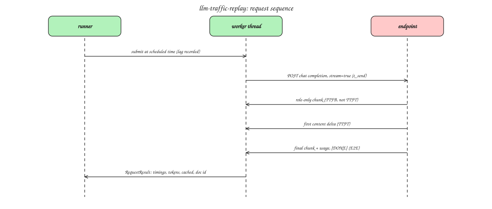

# Architecture

## Components and data flow

Editable source: `diagrams/architecture.excalidraw` (excalidraw.com).

## Per-request sequence

Editable source: `diagrams/request-sequence.excalidraw` (excalidraw.com).

## Design decisions and their tradeoffs

**Standard library HTTP client, threads not asyncio.** One dependency
(numpy) instead of an async stack. Blocking socket reads release the GIL,
so hundreds of concurrent streams are fine. The cost is thread overhead at
extreme concurrency; the mitigation is honest measurement (dispatch lag is
reported per request) plus `shard` support to split a schedule across
processes or machines when a single client saturates. For a single-node
endpoint evaluation, the endpoint saturates long before the client does.

**TTFT keys on first content delta, not first byte.** Real servers send a
role-only chunk immediately on connection; timing that would flatter the
endpoint. The bundled mock deliberately reproduces this trap and the test
suite asserts the client does not fall into it. Known limitation, stated
rather than hidden: for reasoning models that stream a reasoning channel
before visible output, the first reasoning delta counts as first content.
If the SLO under test is time to first VISIBLE token, agree on that
definition before the run; splitting the two timestamps is a planned
extension and the current behavior always errs toward the stricter
(earlier) reading.

**Cache is constructed, never asserted.** The pool guarantees the traffic
STRUCTURE (shared leading text, popularity skew, cold first-uses). Whether
a request actually hits is the endpoint's business, read back from the
usage block, with the exact field name recorded. When an endpoint does not
report cached tokens, the report says NOT REPORTED rather than guessing.

**Token counts are targeted, reported, and corrected.** Text is generated
to a characters-per-token budget, cpt is recalibrated during the warmup
pass from endpoint-reported prompt_tokens, and the residual targeting
error is printed in every report. Endpoint-reported counts are the source
of truth everywhere.

**Determinism by seed.** Profiles, pool assignment, schedules, documents
and suffixes are all seeded. Two runs with the same config are the same
experiment except for the endpoint's behavior, which is the variable under
test.

**Instrument validated before use.** `python -m traffic_replay validate`
runs the whole pipeline against the bundled mock, whose latency model is
known by construction and whose server-side truth log is joined back to
client measurements by request id. The suite asserts error bounds; the
validate command prints them. Numbers from an unvalidated instrument are
not numbers.

## Failure modes handled

- Endpoint rejects `stream_options.include_usage`: detected on first 400,
  learned, retried without it, remembered for the rest of the run.
- Connection errors: one retry, counted and reported per request.
- Stream ends with no content: recorded as a failure with reason, never a
  silent zero.
- Non-200: status and first 300 chars of the body land in the result row.
- Client saturation: visible as dispatch lag percentiles, not blended into
  endpoint latency.
- Cold cache at run start: warmup/calibration phase is logged separately
  (`phase` field) and excluded from the replay summary.
