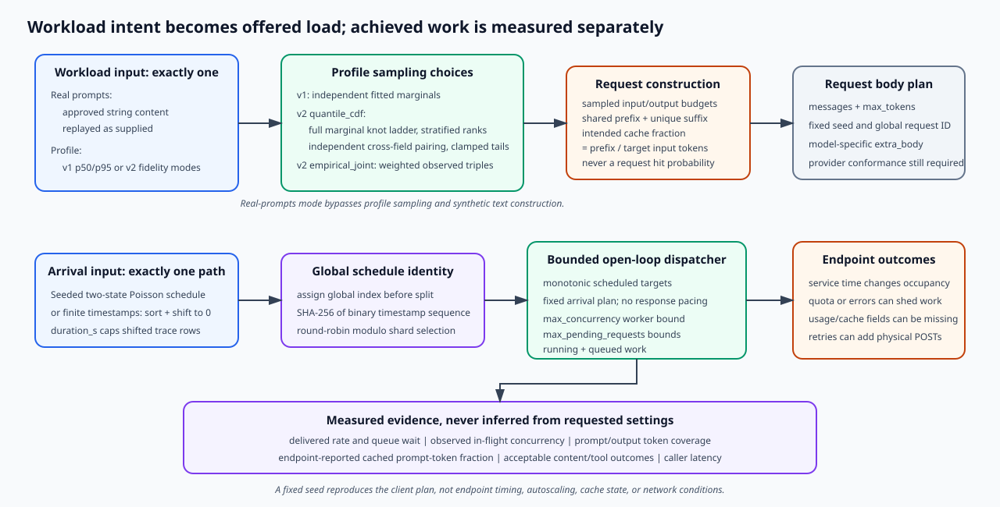

# Architecture

The harness is an open-loop dispatcher, a bounded pool of blocking streaming
clients, and a crash-safe evidence writer. It deliberately keeps workload
intent, physical request attempts, endpoint/service clocks, and
caller-experienced clocks separate.

## Run lifecycle

The runner follows this order:

1. Validate the run config and exactly one workload input.
2. Snapshot package source identity and copy workload files to private,
   immutable temporary bytes.
3. Exclusively claim the output directory and durably write
   `.traffic-replay-writing`, `start.json`, and an empty
   `requests.jsonl.partial` before target traffic.
4. Parse the private workload snapshot, resolve credentials, and construct the
   client.
5. Capture best-effort network-path and endpoint metadata evidence.
6. If requested, send an unloaded sizing sample and derive one fixed
   open-loop rate and worker bound. The derived worker bound is capped by an
   explicit `max_concurrency`, or by the default 256-thread safety ceiling
   when that field is omitted.
7. Generate the entire unsharded schedule, compute its binary identity, select
   the shard's globally indexed subset, and update `start.json`.
8. Send calibration requests. In profile mode, successful endpoint-reported
   prompt usage can adjust the characters-per-token estimate.
9. Dispatch measured arrivals against monotonic schedule targets. The
   executor and pending-future map are bounded. A full pending bound creates a
   journaled unsent failure instead of unbounded memory growth.
10. Append each observed outcome to the durable partial journal as collection
    sees it. Rows can be in completion order; `global_index` retains workload
    order.
11. Drain outstanding work, sync the journal, and summarize persisted replay
    rows.
12. Atomically promote `requests.jsonl`, write summary and reports, write the
    manifest last, and promote the writing marker to
    `.traffic-replay-complete` only after the manifest is durable.

The higher-level `benchmark` and `sweep` preflight occurs before step 1 of the
runner lifecycle. Its two representative requests and any explicitly supplied
model-control candidate probes are real, billable traffic, but their rows are
not included in the runner's sealed journal or manifest. The tool does not
guess provider controls. Preserve CLI output externally when the preflight
decision itself must be audited.

An editable high-level overview is
[architecture.excalidraw](diagrams/architecture.excalidraw). The more detailed
SVG used above is [architecture.svg](diagrams/architecture.svg) and is
maintained separately; architecture changes must keep both views consistent.

## Workload construction

Profile mode and prompts mode share the scheduler and client but have different
fidelity boundaries.

Profile mode samples token and intended cached-prefix shapes, constructs text,
and selects shared-prefix documents from a deterministic Zipf pool. The pool
creates an opportunity for prefix reuse. Only endpoint-reported
`cached_tokens / prompt_tokens` is an achieved cached prompt-token fraction.
The intended fraction is not a request cache-hit rate.

Prompts mode replays supplied text. If requests outnumber prompts, it cycles
the list; repeated prompts can warm an endpoint cache. That is replay behavior
unless the production workload has the same repeat pattern.

The synthetic scheduler is a two-state modulated Poisson process followed by
seeded thinning. A timestamp trace replaces it, is sorted, shifted to zero,
and capped by `duration_s`. The runner creates all global indices before shard
selection so schedule and coverage identities are auditable.

## Request sequence and clocks

For one logical replay row:

1. The dispatcher waits until the scheduled monotonic target.
2. It submits to the worker pool if the pending bound has room.
3. The worker records exact queue wait, opens a fresh connection, and records
   `connect_ms` across DNS, TCP, and TLS setup.
4. The final-attempt service clock begins immediately before `POST`.
5. Streaming events update TTFB, first content, first reasoning, first visible
   content, first tool-call fragment, interchunk gaps, and end-to-end time.
   TTFB begins at the first iterated response-body line. End-to-end stops at
   `[DONE]`, or at response EOF when `[DONE]` is absent; a `finish_reason`
   records completion semantics but does not itself stop the response reader.
6. Tool-call fragments are assembled only long enough to verify a nonempty
   function name and arguments that decode to a JSON object. Argument content
   is not persisted.
7. The caller clocks measure from the scheduled target to the same observed
   events. They include queueing, connection setup, fallback requests,
   credential refresh, and configured transport retries.

The final-attempt metrics exclude connection setup but include request upload,
network and edge transit, endpoint work, and response transit. They must not be
labeled pure server compute time. The separate network probe resolves DNS
outside its timer and records `tcp_connect_min_ms` and
`tcp_connect_median_ms`. Those fields are not exact RTT and cannot be
subtracted to recover endpoint time.

## Outcome populations

These populations are not interchangeable:

- HTTP status describes transport response status when observed.
- A content stream means visible or reasoning content arrived.
- An acceptable outcome means visible content or a structurally valid tool
  call, clean stream completion, and no parse errors.
- Semantic correctness is not measured.

Primary answer-latency percentiles use acceptable outcomes when current answer
observability fields exist. Errors and unacceptable outcomes remain in failure
and success-rate accounting. `finish_reason=length` is reported but is not by
itself an unacceptable outcome; truncation by the global cap is called out
separately because it means the requested workload was not reproduced.

Tool-call-only outcomes can be acceptable without a visible-token TTFT. Their
first tool-call timing is reported separately.

## Retry model

The configured transport retry count defaults to zero. Connection and request
attempt counters show whether a physical `POST` was attempted. When a
configured transport retry occurs, `retry_reasons` distinguishes a connection
failure before `POST` from a transport error after a possible `POST`; the
latter can duplicate inference and billing. A final failure that is not
retried remains in `error` and does not add a retry reason.

The streamed-usage compatibility fallback and one credential-refresh retry can
also create a second physical `POST` independently of the configured transport
retry count. Every row records connection attempts, physical request attempts,
and retry reasons. The system offers no exactly-once guarantee.

## Evidence model

`start.json` is the pre-traffic and in-progress provenance record. It includes
redacted effective configuration, workload/input digests, source identity,
logical/execution/artifact IDs, target evidence when available, exact schedule
and shard identities, and calibration results.

`requests.jsonl.partial` is the active journal. It is synced every 16 appended
rows by default, after measured replay drains before the rows are reread, and
during finalization or exception cleanup. Sizing and calibration transitions
do not force an additional journal sync. An interrupted final fragment can be
ignored, but a directory retaining `.traffic-replay-writing` is never a
completed benchmark.

On success, manifest schema v3 binds `requests.jsonl`, `summary.json`,
`report.md`, `report.html`, and `start.json` by SHA-256 and byte count, plus a
row count for the request journal. The writer stores the artifact identity,
manifest digest and size, and request-row count in the completion marker and
promotes that marker last. Aggregate readers verify the entire marker,
manifest, and request-journal chain before accepting an input.

Aggregate readers reject incomplete runs, unsupported schemas, nonregular or
symlinked artifacts, integrity mismatches, duplicate artifacts, and malformed
identity data. `--force` can produce an explicitly INVALID diagnostic merge
for compatibility or incomplete shard coverage; it cannot turn corrupt or
unsealed evidence into valid evidence.

## Boundedness and backpressure

`max_concurrency` bounds worker threads. `max_pending_requests` bounds running
plus queued futures; when omitted it is computed as
`max(2 * max_concurrency, max_concurrency + 1)`. The journal avoids a
run-sized in-memory result list while traffic is active. However, the complete
unsharded schedule and profile-mode sampled workload arrays scale with the
global request count. Exact percentile summarization also rereads persisted
replay rows after the workload drains. The tool is therefore bounded in active
client work, not constant-memory in total run size.

A pending-limit drop is a client-side failure and no inference request is sent
for that row. A saturated pool appears in exact queue wait and caller latency;
the dispatcher lag alone cannot detect executor queueing.

## Security boundaries

- Bearer credentials are allowed only over HTTPS or explicit loopback HTTP.
- `base_url` is an origin, while the request path is configured separately.
- Named Databricks profiles are bound to the same normalized origin and fail
  closed on mismatch or token-resolution failure.
- `extra_body` is persisted as request evidence, so secret-like keys and
  credential-shaped values are rejected recursively before target traffic.
- Artifact configuration and strings pass through semantic secret redaction.
- Non-200 bodies are represented only by status, sampled byte length, and a
  truncated body digest.
- Input prompts are needed in memory for replay but are not copied into
  request result rows. Tool argument content is likewise not persisted.

## Portability boundary

The client implements a tested subset of streamed Chat Completions behavior.
An endpoint described as compatible can still differ in route, authentication,
model selection, request controls, SSE framing, tool-call deltas, usage fields,
tokenizer, cache semantics, retry safety, and quotas. Provider comparison
requires conformance testing and achieved-workload evidence; changing only the
URL is not a portability proof.
